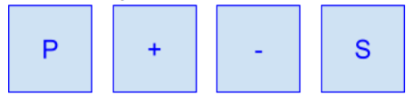

# projeto_automacao
 
## Controlador Proporcional

* **Objetivo:**

	Projetar um sistema de controle de temperatura capaz de aquecer e resfriar o ambiente
baseado na temperatura atual e na temperatura programada. O controlador deverá ser do
tipo Proporcional e as saídas para o drive do tipo PWM. Um led de vida do sistema (Heart
Beat), deverá oscilar em 0,5Hz sempre que o sistema estiver energizado e o drive estiver
habilitado. Caso driver seja desabilitado o Led deverá permanecer aceso.

   

* **Sistema:**

	O bloco de interface deve conter um display de LCD 16x2 e 4 botões. O display
deverá apresentar a temperatura atual, a temperatura desejada (set-point) e o estado atual
da saída (aquecendo, resfriando, desabilitado). Os botões são utilizados para alterar o os
parâmetros do controlador e valor de set point:
Teclado:
P: Programar/Alternar telas.
+: Incrementa um valor numérico, modifica uma saída para ON.
-: Decrementa um valor numérico, modifica uma saída para OFF.
S: Confirma o ajuste atual.

   

Os botões do teclado servem para ajustar:
? Um novo set-point.
? Valor do ganho proporcional do controlador.
? Desabilitar o controlador (desligar o driver independente do ajuste de
temperatura)
? Ligar/Desligar manualmente o aquecedor.
? Ajustar o valor da saída do aquecedor no modo manual (0...100%).
? Ligar/Desligar manualmente o ventilador.
? Ajustar o valor da saída do ventilador no modo manual (0...100%).

* **Display:**
O projeto deve apresentar (no mínimo) as seguintes telas:

Tela 1: Estado Atual do Sistema
	SP: Set Point (Valor ajustado de temperatura)
	PV: Process Value (Valor atual de temperatura)
	Heat: Aquecendo (Ligado = ON, Desligado = OFF)
	Driver (Habilitado = ON, Desabilitado = OFF)

Tela 2: Ajuste do Set Point
	SP: Set Point (Valor ajustado de temperatura)

Tela 3: Ajuste do Ganho Proporcional
	Kp: Proportional Gain (Valor do ganho proporcional)

Tela 4: Modo Manual Aquecedor
	Ex.1:
		Estado: ON = Aquecedor Ligado, saída a 50%.
	Ex.2:
		Estado: OFF = Aquecedor desligado, valor da saída 	não deve aparecer.

Tela 5: Modo Manual Ventilador
	Ex.1:
		Estado: ON = Ventilador Ligado, saída a 35%.
	Ex.2:
		Estado: OFF = Ventilador desligado, valor da saída	não deve aparecer.

Tela 6: Desabilitar Driver de saída
	Ex. 1:
		Driver habilitado, tanto para o aquecedor quanto 	para o ventilador

* **Periféricos:**
   * **Sensor:** O Sensor de temperatura utilizado é o sensor analógico LM35.
   * **MCU:** O MCU escolhido para o desenvolvimento foi o ATMega328p (Arduino) e ele é o responsável pelas tarefas de controle e interface do sistema. 
   * **L293D:** Ponte H utilizada para controlar ventilador e aquecedor.
   * **Ventilador:** Utilizado para o modo Fan.
   * **Aquecedor:** Utilizado para o modo Heat.

* **Software:**
   * **IDE:** Foi utilizada Sloeber, IDE do Eclipse para o Arduino.
 
* **Simulação no Proteus e montagem prática**

   

   

